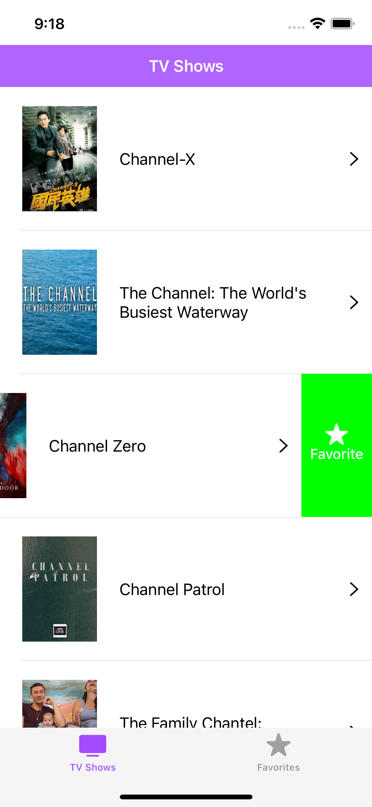
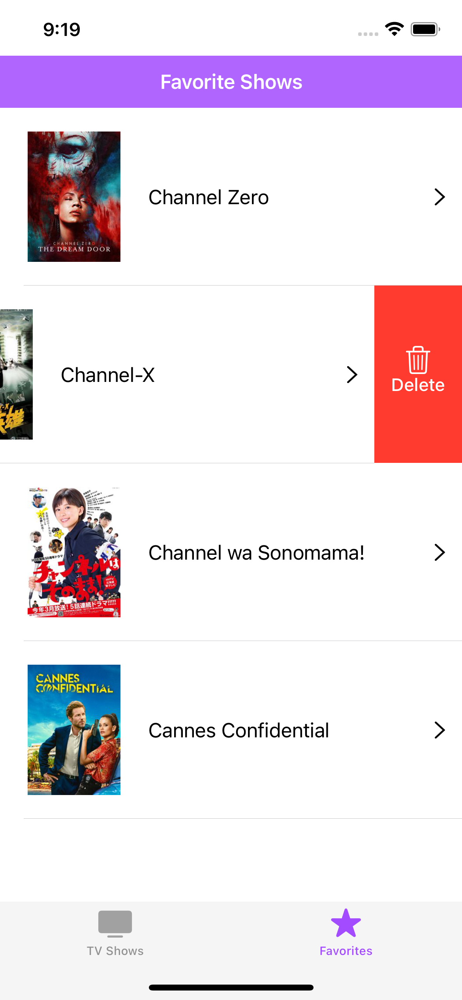
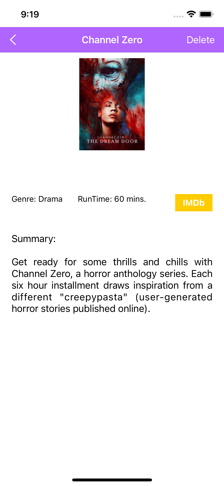
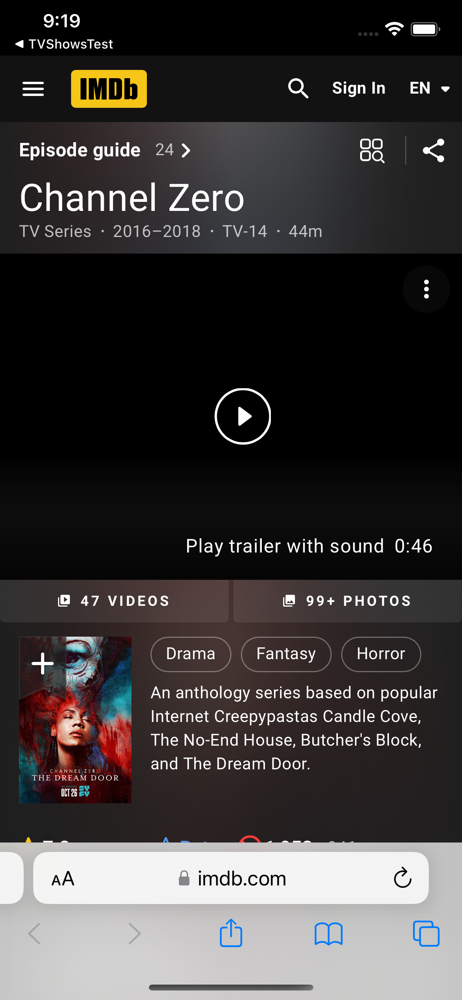

# TVShowsTest

## Ejemplo de App iOS con Swift y consumo de la API REST de TVMAZE

* [TvMaze](https://www.tvmaze.com/api)
* [SDWebImage](https://github.com/SDWebImage/SDWebImage)

## Descripción
es un ejemplo de app iOS con swift la cual consume el api de TVMAZE para mostrar el listado de shows de television, los cuales se pueden marcar como favoritos y verlos en una segunda vista la cual mostrara unicamente los shows de television que se hayan marcado como favoritos, tanto en la vista principal como la vista de favoritos se podra eliminar un show de television que se desee de la lista de favoritos una vez que se haya agregado, al seleccionar un show de television este mostrara los detalles del show en cuestion y tambgien se podra ir a la web de ranking de cada show.

         

         

## Encuéntrame en:
<!--
-->

### Autor
*Abel Lazaro. © 2022-2023*